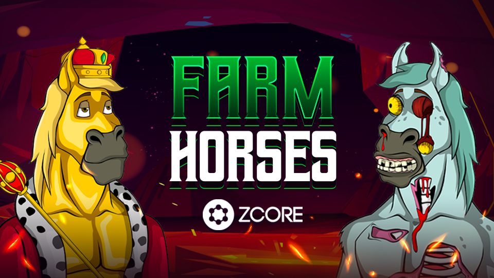

# 🐎 NFT农场马

<figure><figcaption>
<a href="https://zcore.network/mint.html">https://zcore.network/mint.html</a>
</figcaption></figure>

**收藏介绍**

ZCore Farm Horses代表了ZCore Network（ZCN）内的一种创新的NFT收藏。这个独特的收藏由10,000件数字艺术作品组成，每一件都有其独特和不同的特征。其中，有20个传奇的NFT，是声望和稀有性的象征，还有数以千计的其他NFT，装饰着各种各样的配件，分布在各种类别和稀有度级别。

> :racehorse: Mint NFT :&#x20;
>
> [https://zcore.network/mint.html](https://zcore.network/mint.html)

**持有者的影响和影响力**

拥有一个NFT Farm Horse不仅仅是一个数字资产；它是一个积极参与ZCore社区的钥匙。这些NFT的持有者有权通过DAO（Decentralized Autonomous Organization）影响重要的决策，这是ZCore对去中心化和社区权力的承诺的体现。此外，持有者还积极参与ZCore AI平台举办的艺术锦标赛，展示了网络对创新和创造力的价值。

**财务利益和独家优势**

ZCore Farm Horses为其持有者提供了显著的财务利益。其中一个好处是可以访问一个独家的staking pool，该pool提供了来自ZCR反射的2%的收益，ZCR是网络的本地加密货币。这个staking pool代表了一种独特的被动收入生成机会，强化了这些NFT的内在价值。

> :closed\_lock\_with\_key: Stake NFT :&#x20;
>
> [https://zcore.network/staking.html](https://zcore.network/staking.html)

**Delegators在ZCN网络中的角色**

在ZCN网络中，NFT Farm Horses的持有者扮演着重要的delegators角色。要参加这个独家小组，需要贡献1个NFT Farm Horse和1亿ZCR的投资。这种参与不仅重申了持有者对网络的承诺，而且还提供了对这个pool特定收益的访问，突出了ZCore Network中投资和奖励之间的协同作用。

**结论**

ZCore Farm Horses不仅仅是一个NFT集合；它是一个融合了艺术、金融和社区治理的生态系统。这个集合不仅提供了独特的数字艺术作品，而且为金融机会和在ZCore Network的治理中发出积极声音打开了大门，为NFT世界的一个更加包容和去中心化的未来铺平了道路。
